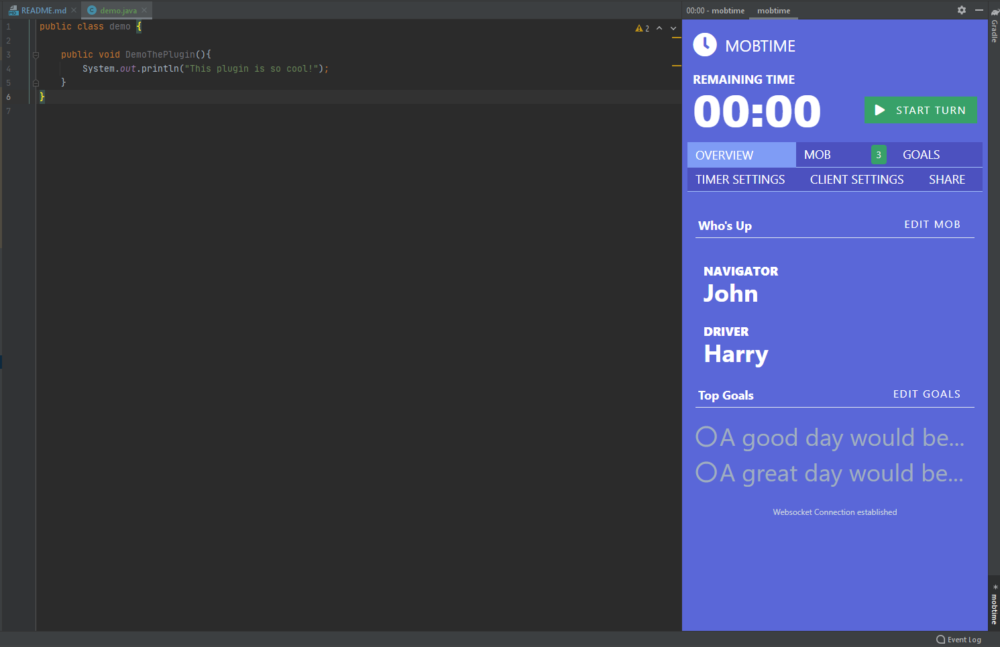

# MobTime Plugin

<!-- Plugin description -->
Implements the mob timer from https://mobti.me/ inside a window in IntelliJ IDEs. 
Structure your mob programming without ever leaving the IDE! <h2> Get it from the JetBrains Plugin Marketplace [here!](https://plugins.jetbrains.com/plugin/16137-mobtime) </h2>

Alert when timer is up: 

<!-- Plugin description end -->

## Installation

- Using IDE built-in plugin system:
  
  <kbd>Settings/Preferences</kbd> > <kbd>Plugins</kbd> > <kbd>Marketplace</kbd> > <kbd>Search for "mobtime"</kbd> >
  <kbd>Install Plugin</kbd>
  
- Manually:

  Download the [latest release](https://github.com/JStruk/mobtime-plugin/releases/latest) and install it manually using
  <kbd>Settings/Preferences</kbd> > <kbd>Plugins</kbd> > <kbd>⚙️</kbd> > <kbd>Install plugin from disk...</kbd> (This is possibly broken right now)

## Development

- Setup for local development
  - Requirements:
    - JDK 14
    - JRE 1.8+
    - IntelliJ IDEA
    - Custom runtime for IDEA [Instructions here](https://youtrack.jetbrains.com/issue/IDEA-231833?_ga=2.48638502.1426120811.1614027119-951169486.1614027118#focus=streamItem-27-3993099.0-0)
  
## Deploying
   - To run locally: 
     - Within IntelliJ IDEA:
       - <kbd>IntelliJ IDEA</kbd> > <kbd>Run</kbd> > <kbd>Edit Configurations</kbd> > <kbd>+</kbd> > <kbd>Gradle</kbd> 
       - `Gradle Project: mobtime-plugin`
       - `Task: runIde`
       - <kbd>Apply</kbd> > <kbd>OK</kbd>
      - From command line: 
        - Inside root folder: `./gradlew runIde`
   - To compile `mobtime-plugin-{version}.zip` for installing plugin
      - Inside root folder: `./gradlew buildPlugin`
      - Find `.zip` file at `mobtime-plugin/build/distributions`

 

## Known Issues
 - This plugin requires JCEF support in your IDE. This was released as part of IntelliJ version 2020.2. You may encounter errors such as:
   - `JCEF is not supported in this env or failed to initialize `
   - `JCEF runtime library is not a JBR module`
- The alert logic is based off the webpage title. Ideally we would have a handler for notifications sent from the webpage and handle them properly. If this is possible in CEF, please feel free to put up an issue or a PR with a possible solution :) 
  
  Please post an issue on the repo if you encounter any bugs (especially relating to JCEF). It's appreciated.

---
Plugin based on the [IntelliJ Platform Plugin Template][template].

[template]: https://github.com/JetBrains/intellij-platform-plugin-template
